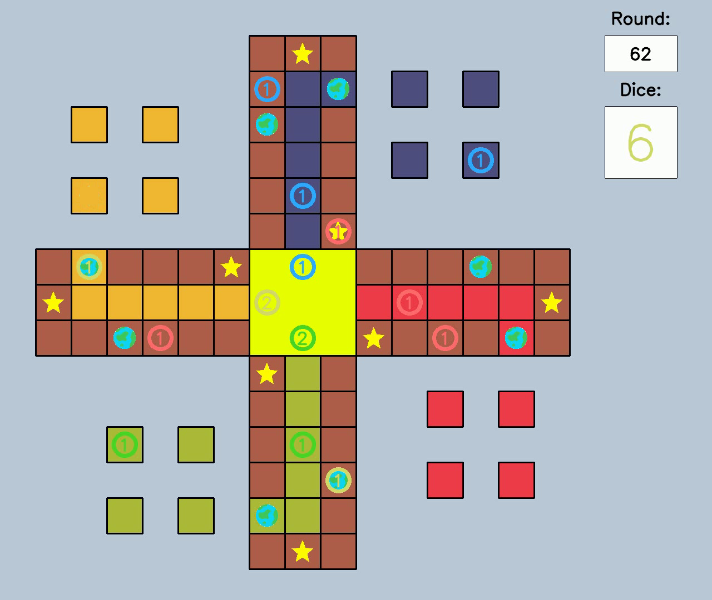

# YARAL: Yet Another Reinforcement learning  Approach to Ludo
A Q learning AI player for the LUDO board game.

## Motivation
The object of the project was to create a player policy that learns to play the board game LUDO using a common reinforcement learning technique. This project was developed as part of the *Tools of Artificial Intellignece* class at the *University of Southern Denmark* in the Spring of 2021.

## Screenshots

## Features
---

## Code Example
---

## Installation
Provide step by step series of examples and explanations about how to get a development env running.

## How to use?
To use my player import Qlearn.py and Qs.txt from the LUDOpy-QLearn/test
You may need to edit the path in self.tablename on line 51

Define player:
  player0 = Qplayer()

Make move:
  player0.nextmove(player_i, player_pieces, enemy_pieces, dice, move_pieces)
            piece_to_move = player0.piece
            _, _, new_P0, new_enemy, _, there_is_a_winner = g.answer_observation(piece_to_move)

## Credits
Give proper credits. This could be a link to any repo which inspired you to build this project, any blogposts or links to people who contrbuted in this project. 
